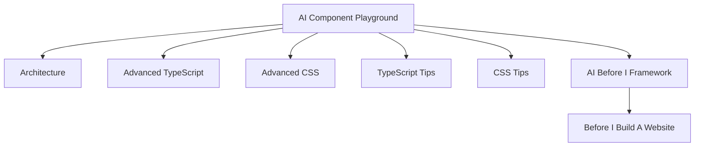
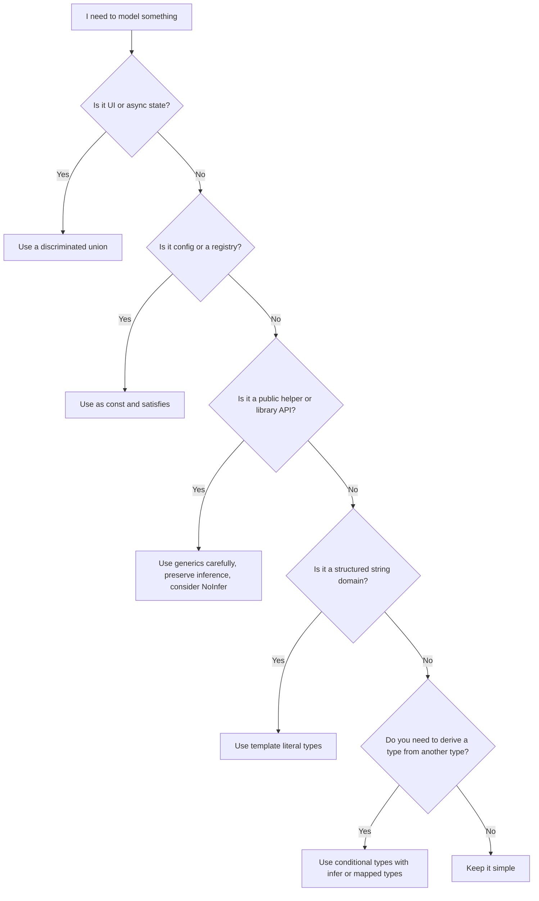
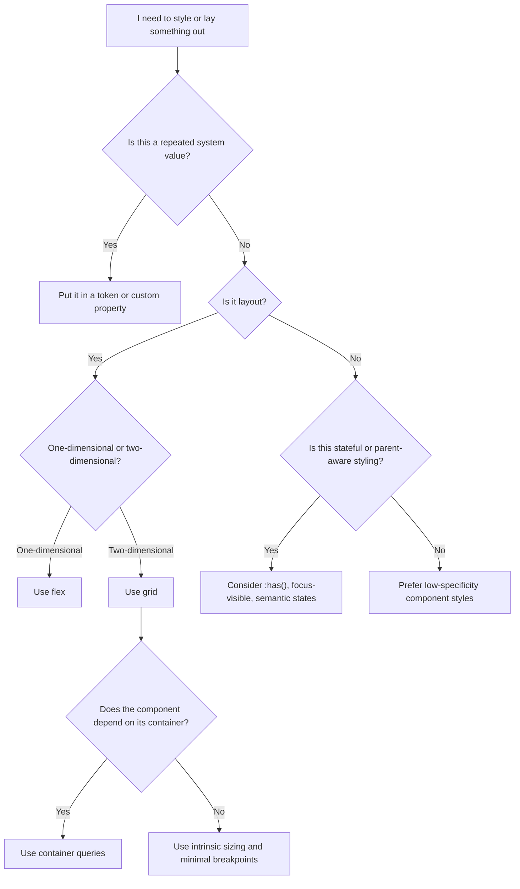
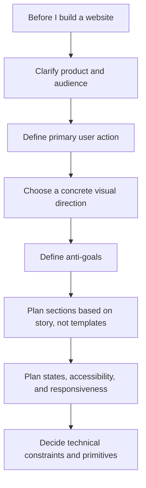

# Visual Maps And Checklists

## Knowledge Map

## TypeScript Decision Tree

## CSS Decision Tree

## Before I Build A Website Flow

## TypeScript Review Scorecard

Use this when reviewing a component, utility, or library API.

| Area | Good Signal | Warning Sign |
|---|---|---|
| State modeling | Discriminated unions | Multiple booleans and optional bags |
| Inference | Values stay precise | Everything widens to `string` or `any` |
| Config typing | `satisfies`, literal preservation | Broad annotations and manual duplication |
| Public API | Hard to misuse | Too many invalid combinations |
| Assertions | Minimal `as` usage | Assertions everywhere |
| Runtime boundary | Validation exists | Trusting external data blindly |
| Compiler posture | Strict flags enabled | Loose config with hidden holes |

## CSS Review Scorecard

Use this when reviewing a page, component, or system.

| Area | Good Signal | Warning Sign |
|---|---|---|
| Tokens | Shared semantic values | Random per-component values |
| Layout | Grid/flex used intentionally | Layout hacks and magic numbers |
| Responsiveness | Intrinsic sizing and container awareness | Viewport-only breakpoint sprawl |
| Specificity | Low and predictable | Override wars |
| States | Hover, focus, loading, error considered | Happy-path-only styling |
| Accessibility | Focus, contrast, motion handled | Styling that ignores keyboard and contrast |
| Maintainability | Repeated patterns extracted | One-off rules everywhere |

## Website Review Scorecard

Use this before calling a page done.

| Area | Good Signal | Warning Sign |
|---|---|---|
| Clarity | Clear audience and purpose | Generic product language |
| Structure | Sections support the story | Template-driven filler sections |
| Visual direction | Concrete, distinct art direction | "Modern clean" vagueness |
| Interaction | States and feedback feel deliberate | Static ideal-state UI only |
| Responsiveness | Works with awkward content and narrow widths | Breaks outside ideal viewport |
| Accessibility | Focus, contrast, semantics respected | Accessibility bolted on late |
| Performance | Images, layout, and motion are intentional | Heavy visuals with no discipline |

## Quick Checklists

### Before I Start A Component
- What problem does this component solve?
- What prop combinations should be impossible?
- What states and variants exist?
- What accessibility rules apply?
- What examples and tests should exist?

### Before I Start A Page
- What is the user trying to do?
- What is the hierarchy?
- What content is real versus placeholder?
- What does this look like with awkward data?
- What states beyond the happy path need support?

### Before I Build A Website
- What is the site trying to achieve?
- Who is it for?
- What should feel distinct?
- What visual direction am I committing to?
- What patterns am I explicitly avoiding?
- What sections are actually necessary?

### Before I Publish A Library API
- Is the API easy to understand from autocomplete alone?
- Are invalid combinations prevented?
- Does inference stay strong?
- Are names clear?
- Are docs and examples enough for first use?
- What will break in a future version?
